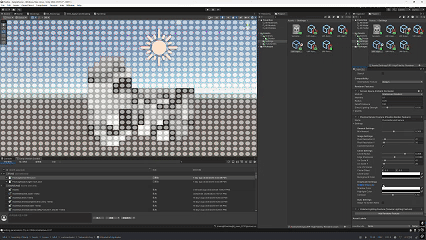
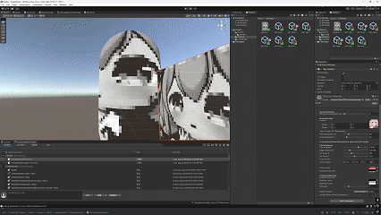

## 黑白半调效果Shader

## 这是什么？

这是我自己对于HLSL学过的一些经验和总结。这个项目中含有大量使用HLSL完成的环境特性。
这是一个受openAI超级碗宣传片启发的，允许运用到全屏效果亦或是物体表面材质效果的半调Shader。
**本项目使用Universal RenderPipeline14，Unity 2022 3.43构建，部分方法名字可能会有所变化。**
## 含有的特性：
- 使用RenderFeature参与的全屏效果Shader
- 像素化使用uv放缩采样实现；圆圈基于SDF实现，UV伸缩尺度可以在才之内更改，以适配不同比例的传入uv。
- 基于opencv算法启发的高光/阴影色彩管理，允许指定高光/阴影颜色并且可以黑白化。

## 效果展示

